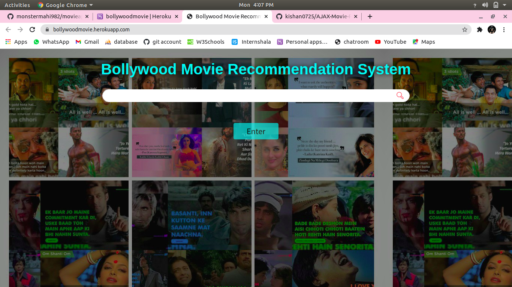
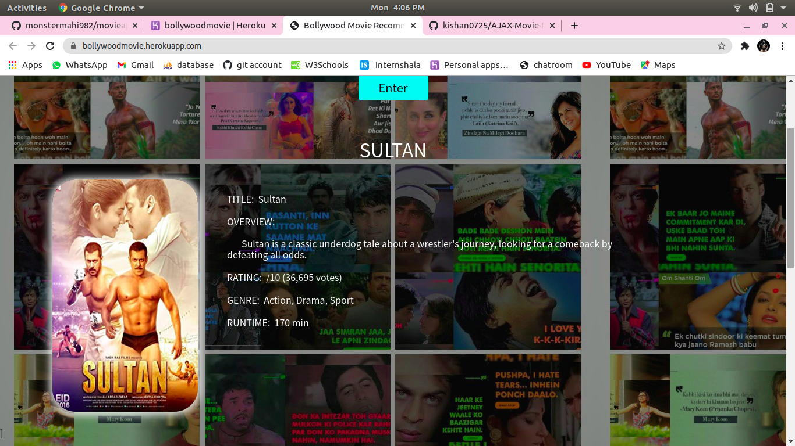
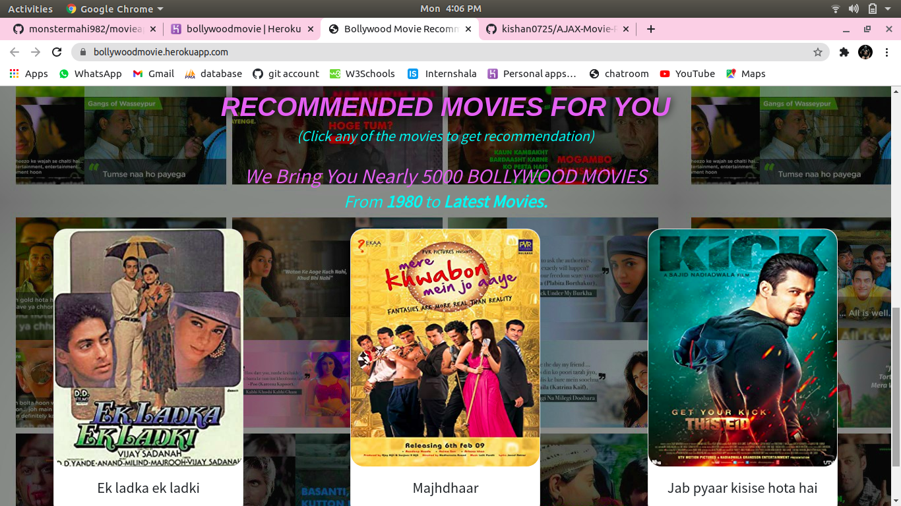

<h1>Bollywood Movie Recommendation System Based On User Searching pattern</h1>

 
<h3>Check out the live demo:--<a href="https://bollywoodmovie.herokuapp.com/">...click here</a></h3>
 

 
<h4>Languages used :--</h4>

1)PYTHON

2)HTML

3)CSS

4)JAVASCRIPT

<h4>Libaries used :--</h4>

1)Flask

2)JQuery

3)Ajax

 
<h5>API used :--<a href="http://www.omdbapi.com/">OMDB website</a></h5>
 

enter any one of your Favourite Bollywood movie name and search ;-----

<h5>Example :- SULTAN</h5>
<h6>output:-----</h6>

 

 
--------------------------------------------------------------------------------
